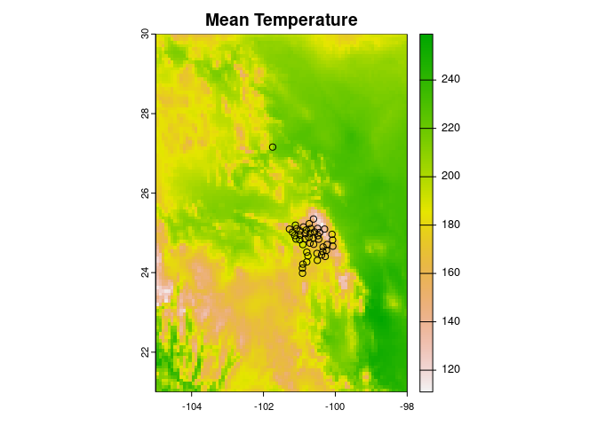
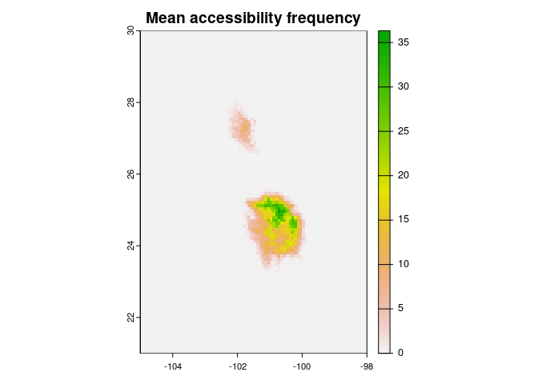
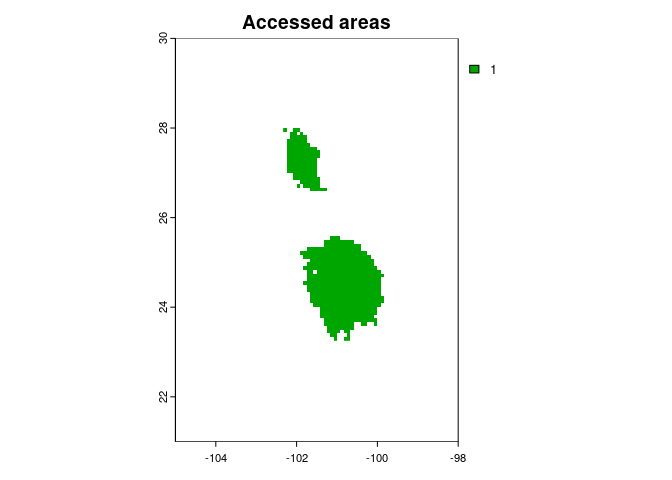
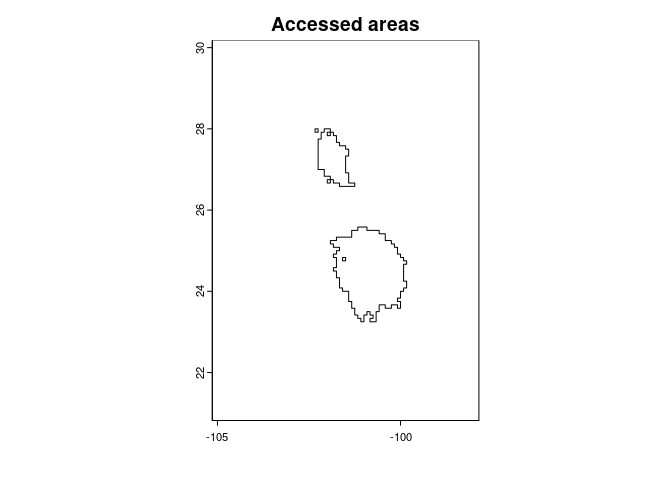

grinnell: Dispersal Simulations Based on Ecological Niches
================
Fernando Machado-Stredel, Marlon E. Cobos, and A. Townsend Peterson

- [Project description](#project-description)
  - [Status of the project](#status-of-the-project)
- [Installation](#installation)
- [M simulation example](#m-simulation-example)
  - [Data for the example](#data-for-the-example)
  - [Running the simulation](#running-the-simulation)
- [Using your own data](#using-your-own-data)
- [Working with Python functions](#working-with-python-functions)
  - [Python requirements](#python-requirements)
  - [M simulation (using Python)](#m-simulation-using-python)
    - [Preparing example data](#preparing-example-data)
    - [The simulation](#the-simulation)

<hr>

## Project description

**grinnell** is an R package to simulate dispersal, colonization, and
accessibility based on niche estimations. One of the main algorithms
implemented here is the simulation of species accessible areas (M),
which can be used as calibration areas in Ecological Niche Models (ENM)
and Species Distribution Models (SDM).

To simulate M, grinnell uses the same inputs needed by several ENM and
SDM: clean occurrences of the study species and a set of climatic layers
(rasters).

### Status of the project

Currently, all processes are implemented in R. The package keeps the
original functions that work with Python, but R functions work faster
due to vectorized implementations. We recommend to use the R versions of
the functions for simplicity and speed. We are testing new functions to
submit the package to CRAN.

<hr>

<br>

## Installation

To install and call `grinnell` use:

``` r
if (!require("remotes")) {
  install.packages("remotes")
}

remotes::install_github("fmachados/grinnell")
library(grinnell)
```

<hr>

<br>

## M simulation example

The example presented here is also part of the examples included in the
documentation of the main function to run the simulation
(`M_simualtionR`). Review this documentation carefully to understand the
method you are bout to use:

``` r
help(M_simulationR)
```

### Data for the example

All data to run the example is included in `grinnell`. Use the code
bellow to load the:

``` r
# occurrence data
data("records", package = "grinnell")

# environmental layers
variables <- terra::rast(system.file("extdata/variables.tif",
                                     package = "grinnell"))
```

You can plot the records over one of the variables using:

``` r
terra::plot(variables[[1]], main = "Mean Temperature")
points(records[, 2:3])
```

<!-- -->

### Running the simulation

The function `M_simulationR` runs the entire set of processes needed to
obtain an area that has been accessible for a species. This includes
steps like performing PCA, defining a hypothesis of suitability for the
species, and the dispersal algorithm itself. For this reason, many
outputs are generated. The best way to avoid excessive use of your RAM
is to store the sub-products in your directory. For that reason, you
need to define an output directory in which to store all these results.
The main results are returned in a list.

The simulation of M will use species occurrences as a `data.frame` and
current climatic variables as a `SpatRaster`. The following example runs
3 replicates of the simulation using a normal dispersal kernel with SD =
1 pixel, considering 25 dispersal events. The maximum number of
dispersers per cell during each dispersal event is 4, which varies
according to the suitability of the cell.

``` r
# output directory
out_dir <- file.path(tempdir(), "eg_Msim")

# example in current scenario
m <- M_simulationR(data = records, current_variables = variables,
                   max_dispersers = 2, replicates = 3, dispersal_events = 25,
                   output_directory = out_dir)
#> Preparing data to run simulation...
#> Preparing raster PCs...
#> Raster PCA finished
#> Check results in:  /tmp/Rtmptqr91H/eg_Msim/PCA_results
#> 
#> Running simulation:
#>   Scenario 1 of 1 - Replicate: 1 2 3 #
#> 
#> Preparing M as a spatial polygon...
#> 
#> M simulation finished
#> Check results in:  /tmp/Rtmptqr91H/eg_Msim
```

The output folder (“eg_Msim”) includes a report from the process, PCA
directory, a suitability directory with an ellipsoidal niche figure, and
the accessible area (M) in shapefile (.shp) and raster (.tif) formats,
among other outputs. You can check the report text file to see the
simulation time and parameters used. A png image will show how the
accessible area (blue outline) looks like, for a quick view.

Now, check some of the results returned in the list:

``` r
# the occurrences used with relevant fields added
head(m$Simulation_occurrences)
#>           species longitude latitude suitability
#> 1 Example_species -101.1105 25.19420  0.26362786
#> 2 Example_species -101.7441 27.15783  0.04634083
#> 3 Example_species -100.8387 24.84999  0.43323210
#> 4 Example_species -101.2774 25.09475  0.49549180
#> 5 Example_species -101.1288 24.93297  0.14450587
#> 6 Example_species -100.2813 24.40710  0.54429078

# a summary of the parameters used
m$Summary
#> $Scenarios
#> [1] 1
#> 
#> $starting_proportion
#> [1] 0.5
#> 
#> $proportion_to_disperse
#> [1] 1
#> 
#> $sampling_rule
#> [1] "random"
#> 
#> $Dispersal_events
#> [1] 25
#> 
#> $Replicates
#> [1] 3
#> 
#> $Dispersal_kernel
#> [1] "normal"
#> 
#> $Kernel_spread_SD
#> [1] 1
#> 
#> $Max_dispersers
#> [1] 2

# plotting M results
## map of frequency of accessibility
terra::plot(m$A_mean, main = "Mean accessibility frequency")
```

<!-- -->

``` r

## accessible areas in raster format
lims <- terra::ext(m$A_mean)[]  # limits for plotting

terra::plot(m$A_raster, main = "Accessed areas", xlim = lims[1:2], 
            ylim = lims[3:4])
```

<!-- -->

``` r

## accessible areas in vector format
terra::plot(m$A_polygon, main = "Accessed areas", xlim = lims[1:2], 
            ylim = lims[3:4])
```

<!-- -->

<hr>

<br>

## Using your own data

Running the M simulation in R is now a lot easier. Follow the example
from above to run a simulation using only a current Environmental
scenario. If you want to explore using the M simulation in framework
that considers cyclic Glacial and Inter-glacial environmental
conditions, and/or use dispersal barriers, you can see the argument
description and the examples in the function documentation:

``` r
# Check the functions help
help(M_simulationR)
```

<hr>

<br>

## Working with Python functions

The original version of the dispersal simulation algortihm was written
in Python. Now all processes can be run directly in R without Python. If
you want to try running with the options that use Python, check the
descriptions and code below.

### Python requirements

Please download and install [Python](https://www.python.org/downloads/)
3.6 or higher in your computer. If you have Anaconda already installed
in your system, you can skip this section.

You can check your current Python version in R with:

``` r
# Windows
system("python --version")

# Mac & Linux
system("python3 --version")
```

In each new R session, before using `grinnell`, you should call Python:

``` r
# You can find your Python path using:
# Windows
system("py -0p")

# Mac & Linux
Sys.which("python3")

# Set your Python path
py.path <- "YOUR-PATH/TO/PYTHON" # e.g., "C:/Python/Python39"

# Call Python
Sys.setenv(PATH = paste(py.path, Sys.getenv()["PATH"], sep = ";"))
# You can verify that the correct version is called using the system() function as in the previous step
```

If you don’t have Anaconda, the **numpy** library needs to be added
using the pip module:

``` r
# Windows
system("python -m pip install numpy")

# Mac & Linux
system("python3 -m pip install numpy")
```

<hr>

<br>

### M simulation (using Python)

#### Preparing example data

Here is one of the examples from the M_simulation function’s help
section. This creates some temporary directories and uses data from the
package:

``` r
tempdir <- file.path(tempdir(), "msim")
dir.create(tempdir)

# Occurrences
data("records", package = "grinnell")
occ <- paste0(tempdir, "/records1.csv")
write.csv(records, occ, row.names = FALSE)

# Current climate variables
variables <- terra::rast(system.file("extdata/variables.tif",
                                     package = "grinnell"))

cvariables <- paste0(tempdir, "/variables") 
dir.create(cvariables)

vnam <- paste0(cvariables, "/var_", 1:6, ".asc")
terra::writeRaster(variables, filename = vnam)

# Results will be stored here:
odir1 <- paste0(tempdir, "/eg_msim1")
```

#### The simulation

The simulation of M will use a species occurrences `data.frame` and a
folder with current climatic variables in raster format (.asc). The
following example runs 3 replicates of the simulation using a normal
dispersal kernel with SD = 1 pixel during 5 dispersal events. The
maximum number of dispersers per cell during each dispersal event is 2,
which varies according to the suitability of the cell. The function sued
to interact with Python has slightly different arguments compared to
`M_simulationR`, make sure you check its documentation using
`hel(M_simulation)`.

``` r
M_simulation(data = occ, current_variables = cvariables,
             dispersal_kernel = "normal", kernel_spread = 1,
             max_dispersers = 2, dispersal_events = 5, replicates = 3,
             output_directory = odir1)
```

The output folder (“eg_msim1”) includes basically all of the results
created using the function `M_simulationR`. A png image will show how
the accessible area (blue outline) will look over the current
suitability layer:


