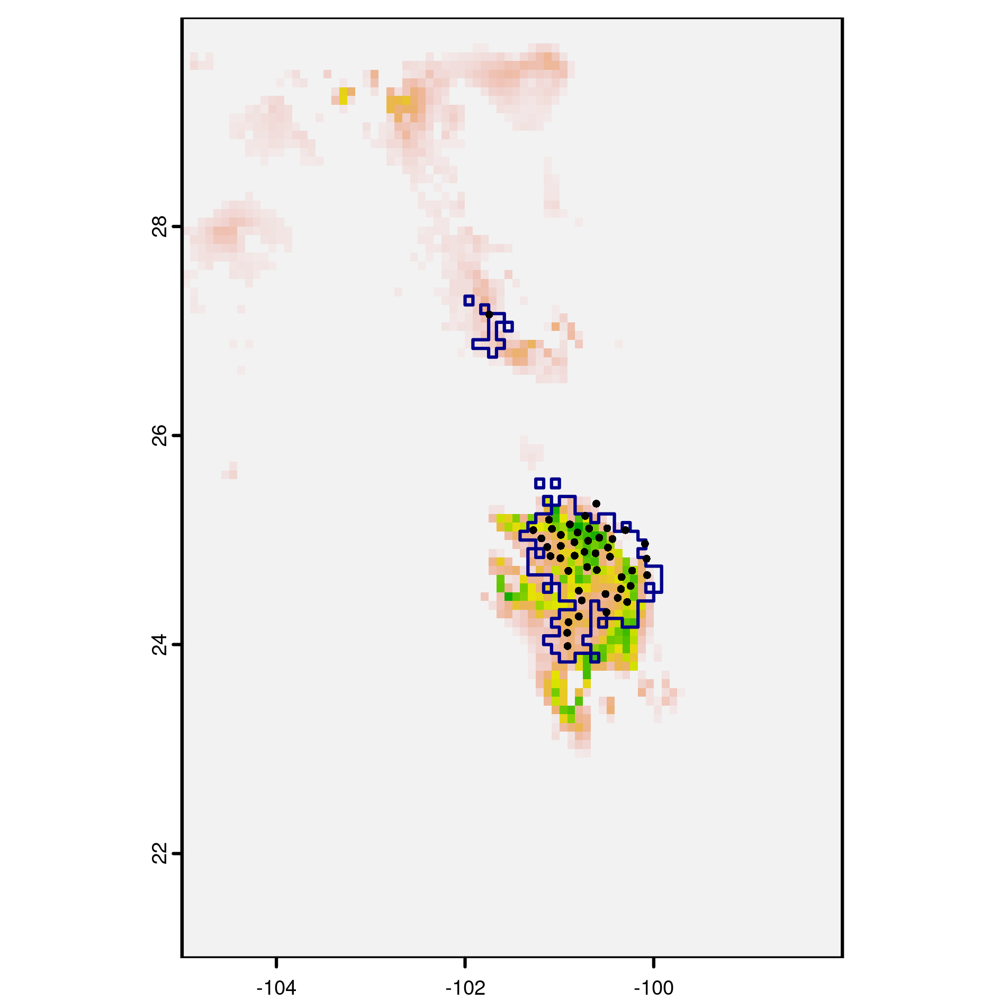

grinnell: Dispersal Simulations Based on Ecological Niches
================
Fernando Machado-Stredel, Marlon E. Cobos, and A. Townsend Peterson

-   [Project description](#project-description)
    -   [Status of the project](#status-of-the-project)
-   [Installation](#installation)
-   [Python requirements](#python-requirements)
-   [M simulation](#m-simulation)
    -   [Using example data](#using-example-data)
    -   [Using your own data](#using-your-own-data)

<hr>

## Project description

**grinnell** is an R package to simulate dispersal and accessibility
based on niche estimations. One of the main functionalities is the
simulation of species accessible areas (M), which can be used as
calibration areas in Ecological Niche Models (ENM) and Species
Distribution Models (SDM).

To simulate M, grinnell uses the same inputs needed by several ENM and
SDM: clean occurrences of the study species and a set of climatic layers
(rasters).

### Status of the project

Currently, input and output processing are done in R, while the
simulation runs in Python. We are testing new functions to migrate to R
and submit the package to CRAN.

<hr>

## Installation

To install and call **grinnell** use:

``` r
if (!require("remotes")) {
  install.packages("remotes")
}

remotes::install_github("fmachados/grinnell")
library(grinnell)
```

Mac users might need to install packages like **rgeos** and **rgdal**
manually or update XCode Command Line Tools.

<hr>

## Python requirements

Please download and install [Python](https://www.python.org/downloads/)
3.6 or higher in your computer. If you have Anaconda already installed
in your system, you can skip this section.

You can check your current Python version in R with:

``` r
# Windows
system("python --version")

# Mac & Linux
system("python3 --version")
```

In each new R session, before using **grinnell**, you should call
Python:

``` r
# You can find your Python path using:
# Windows
system("py -0p")

# Mac & Linux
Sys.which("python3")

# Set your Python path
py.path <- "YOUR-PATH/TO/PYTHON" # e.g., "C:/Python/Python39"

# Call Python
Sys.setenv(PATH = paste(py.path, Sys.getenv()["PATH"], sep = ";"))
# You can verify that the correct version is called using the system() function as in the previous step
```

If you don’t have Anaconda, the **numpy** library needs to be added
using the pip module:

``` r
# Windows
system("python -m pip install numpy")

# Mac & Linux
system("python3 -m pip install numpy")
```

<hr>

## M simulation

### Using example data

Here is one of the examples from the M\_simulation function’s help
section. This creates some temporary directories and uses data from the
package:

``` r
tempdir <- file.path(tempdir(), "msim")
dir.create(tempdir)

# Occurrences
data("records", package = "grinnell")
occ <- paste0(tempdir, "/records1.csv")
write.csv(records, occ, row.names = FALSE)

# Current climate variables
variables <- raster::stack(system.file("extdata/variables.tif",
                                       package = "grinnell"))
cvariables <- paste0(tempdir, "/variables") 
dir.create(cvariables)
vnam <- paste0(cvariables, "/var.asc")
raster::writeRaster(variables, filename = vnam, format = "ascii",
                    bylayer = TRUE, suffix = 1:6)

# Results will be stored here:
odir1 <- paste0(tempdir, "/eg_msim1")
```

You can plot the records over one of the variables using:

``` r
plot(raster(paste0(tempdir, "/variables/var_1.asc")), legend.args = list(text = "Mean Temperature",
side = 4, line = 2.5))
points(records[,2:3])
```


The simulation of M will use a species occurrences data frame and a
folder with current climatic variables in raster format (.asc). The
following example runs 3 replicates of the simulation using a normal
dispersal kernel with SD = 1 pixel during 5 dispersal events. The
maximum number of dispersers per cell during each dispersal event is 2,
which varies according to the suitability of the cell.

``` r
M_simulation(data = occ, current_variables = cvariables,
             dispersal_kernel = "normal", kernel_spread = 1,
             max_dispersers = 2, dispersal_events = 5, replicates = 3,
             output_directory = odir1)
```

The output folder (“eg\_msim1”) includes a PCA directory, a suitability
directory with a fundamental niche ellipsoid, and the accessible area
(M) in shape format, among other outputs. You can check the report text
file to see the simulation time and parameters used. A png image will
show how the accessible area (blue outline) will look over the current
suitability layer:



### Using your own data

Before using **grinnell** remember to call Python (if you are in a new R
session):

``` r
# Set your Python path
py.path <- "YOUR-PATH/TO/PYTHON" # e.g., "C:/Python/Python39"

# Call Python
Sys.setenv(PATH = paste(py.path, Sys.getenv()["PATH"], sep = ";"))

# Verify that Python 3.6 or higher has ben called:
# Windows
system("python --version")

# Mac
system("python3 --version")
```

To run the simulation in current climate layers with your own occurrence
data, you can use something similar to the code below. Simulation time
increases by layer extent (mask your rasters to a geographic region of
interest or G), layer resolution, number of occurrences, number of
replicates and number of dispersal events.

``` r
# Set your directory
setwd("YOUR/PATH")

# occurrences file in your directory
occ <- "records.csv" # Column format is: species, longitude, latitude

# directory with climatic variables 
variables <- "./variables" # Make sure to mask them first (avoid using global layers if not needed)

# define an output directory
out.dir <- "SimM_example" 

M_simulation(data = occ, current_variables = variables,
             dispersal_kernel = "normal", kernel_spread = 1,
             max_dispersers = 2, replicates = 10, dispersal_events = 40,
             output_directory = out.dir)
```
